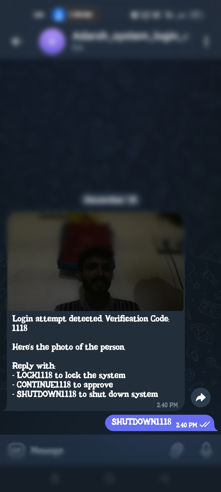

# intrusion_detection_linux

### This Intrusion Detection System for Linux adds an extra layer of security to user logins. 
### Whenever someone attempts to log in to the system, it sends a real-time alert to my Telegram account.
### Including a photo of the individual trying to gain access. The system then prompts me to respond with one of three options: **Continue**, **Lock**, or **Shutdown**. 
### Based on my response, the system takes the appropriate action—allowing access if it's me, locking the system to prevent unauthorized access, or shutting down the machine entirely for maximum security. 
### This mechanism ensures immediate awareness and control over login attempts, enhancing the overall security of the system.

